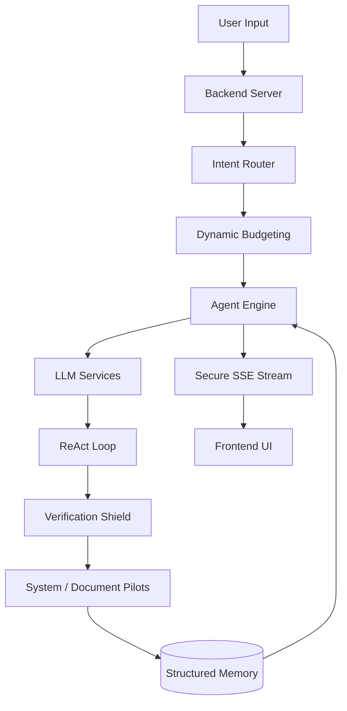

# 🏗️ High-Level Architecture

LAILA is a modular, event-driven local web application utilizing a proprietary dual-stage cognitive pipeline.

## 1. The Components

*   **The Backend:** A lightweight, synchronous server architecture pushing live tokens, state changes, and telemetry via Server-Sent Events (SSE).
*   **The Frontend:** A pure HTML/JS/CSS interface featuring custom CSS-only animations and DOM efficiency. No heavy frameworks are used, ensuring a zero-compilation lightweight footprint.
*   **The Memory Engine:** A consolidated, proprietary structured database that manages active states, execution telemetry, and semantic context truncation.
*   **The Actuators (Pilots):** Isolated execution environments (System and Document Pilots) that act as the "hands" of LAILA, operating safely in a deterministic workspace.

## 2. System Architecture Flow

## 3. The Security & Verification Flow

LAILA's architecture includes a robust "Claim Verifier" shield that intercepts proposed actions before they impact the user environment.

1. **Intent Verification:** Checks if tools were used when necessary.
2. **Ghost Evidence Guard:** Rejects fabricated tool usage.
3. **Execution Reliance Guard:** Ensures failed tools are not hallucinated as successful.
4. **Data Mismatch Guard:** Blocks hallucinated paths or dates.

This multi-layered approach ensures absolute grounding and prevents the LLM from fabricating execution results.
