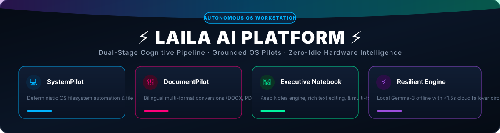
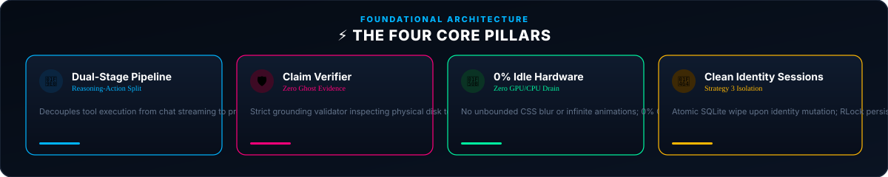
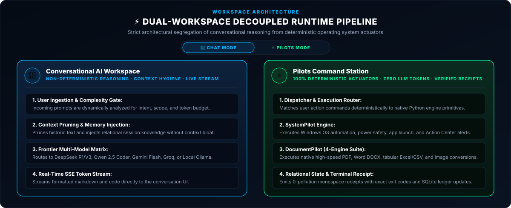
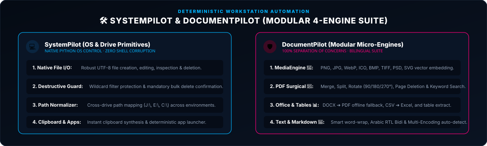
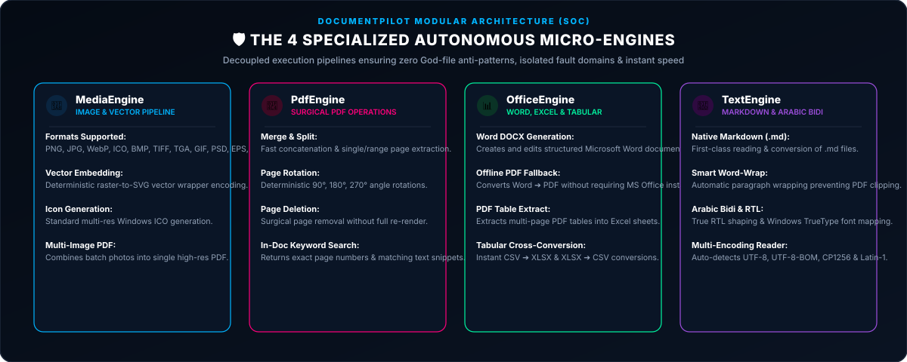
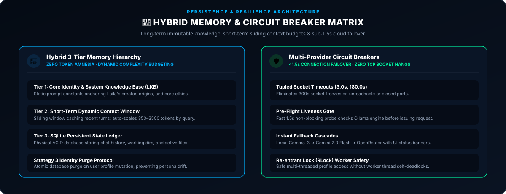
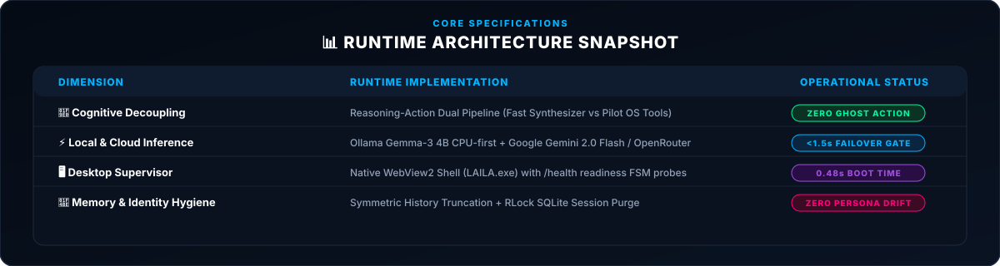

  

    

  
  
  

    

  

 

# 🏗️ LAILA Architecture Overview

LAILA is architected around a dual-stage cognitive pipeline that enforces **Reasoning-Action Decoupling**—strictly segregating the non-deterministic reasoning layer from deterministic actuators and the operating system interface.

---

## 1. Dual-Workspace Decoupled Pipeline

LAILA provides two dedicated runtime workspaces designed to eliminate context pollution and execution bleed:

  

---

  

---

## 2. Deterministic Actuators (The Pilots)

Pilots serve as the high-speed, zero-latency actuators of LAILA. They operate deterministically with **zero LLM tokens and zero prompt inference overhead**.

### 🛠️ SystemPilot
* **Operating System Automation:** Application launching, path resolution, file discovery, and directory inspections.
* **Power Management:** Workstation locking, clean restart, and shutdown with safety guardrails.
* **Action Center Schedulers:** Native Windows 11 notifications, background alarms, and scheduled reminders via `APScheduler`.

### 📄 DocumentPilot (4-Engine Modular Suite)
* **`PdfEngine`:** Surgical PDF manipulations—merging multi-document streams via `pypdf`, page range splitting, rotation (90°/180°/270°), page deletion, keyword searching, and semi-transparent ReportLab vector watermarking.
* **`OfficeEngine`:** Word (`.docx`) document processing, tabular transformations (`.xlsx` ↔ `.csv`), and multi-table extraction from complex PDFs into structured Excel sheets.
* **`ImageEngine`:** Cross-conversion across 13 formats (PNG, JPG, WebP, ICO, TIFF, BMP, PSD, TGA, GIF) and multi-image compilation into unified PDF portfolios.
* **`TextEngine`:** Multi-encoding text parsing, Markdown generation, and Arabic bidirectional layout synthesis (`arabic_reshaper` + `python-bidi`).

---

  

---

## 3. Hybrid Memory Hierarchy

LAILA rejects unstructured, infinitely growing raw text histories. The memory architecture is anchored on a local, consolidated **SQLite relational database**:

* **Conversation Threads:** Strictly bound by session IDs with symmetrical truncation to prevent token bloating.
* **Operational Memory (LKB):** Dynamic key-value operational state tracking working directories, active files, and pending conversions.
* **Trace Telemetry:** Every execution loop, tool invocation, and decision path is ledgered into local telemetry storage for full observability.
* **System Knowledge:** User preferences, hardware configurations, and long-term facts stored permanently without token cost.

---

  

---

## 4. Security, Isolation & Offline Privacy

* **Zero Cloud Leak:** Local inference routes directly to the embedded Ollama engine. No user files, document text, or system metadata ever touch external servers in local mode.
* **Hardware-Backed Encryption:** Provider API credentials (OpenRouter, Gemini, Groq) are protected using the **Windows Data Protection API (DPAPI)**—encrypted with keys tied directly to the user's Windows login.
* **File Safety Gateway:** Dynamic path sanitization, traversal protection, and pre-execution safety confirmations for destructive commands.

---

  

    

  Designed &amp; Engineered by <b>Ahmed Assem</b> • Lead AI Architect

