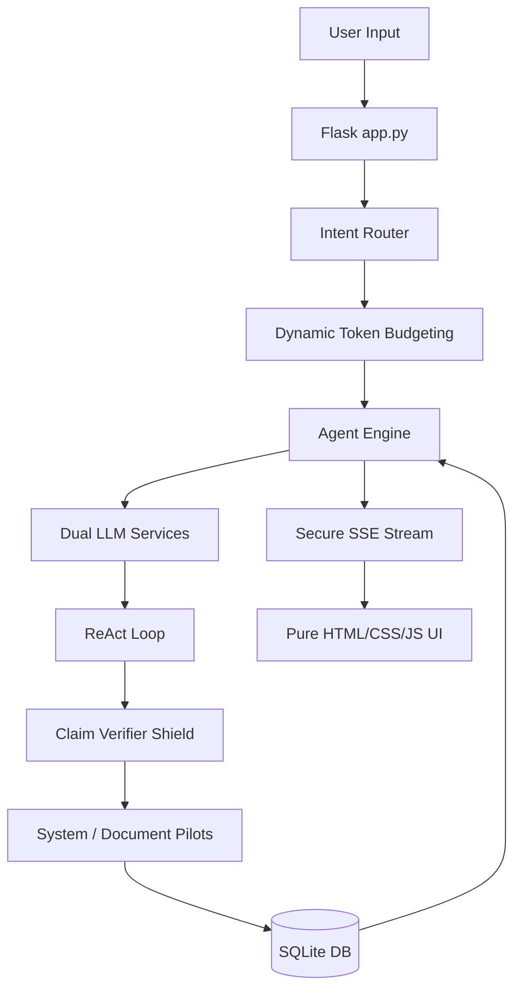
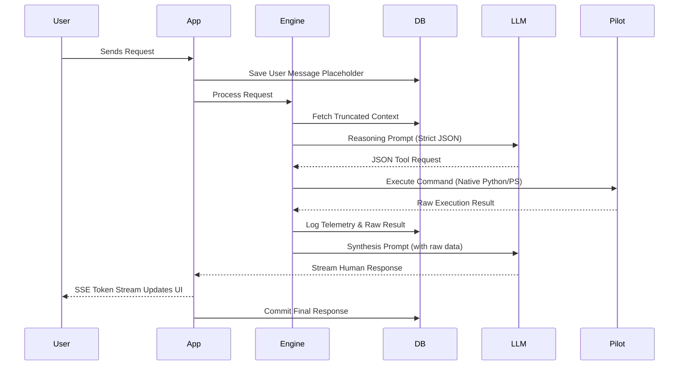
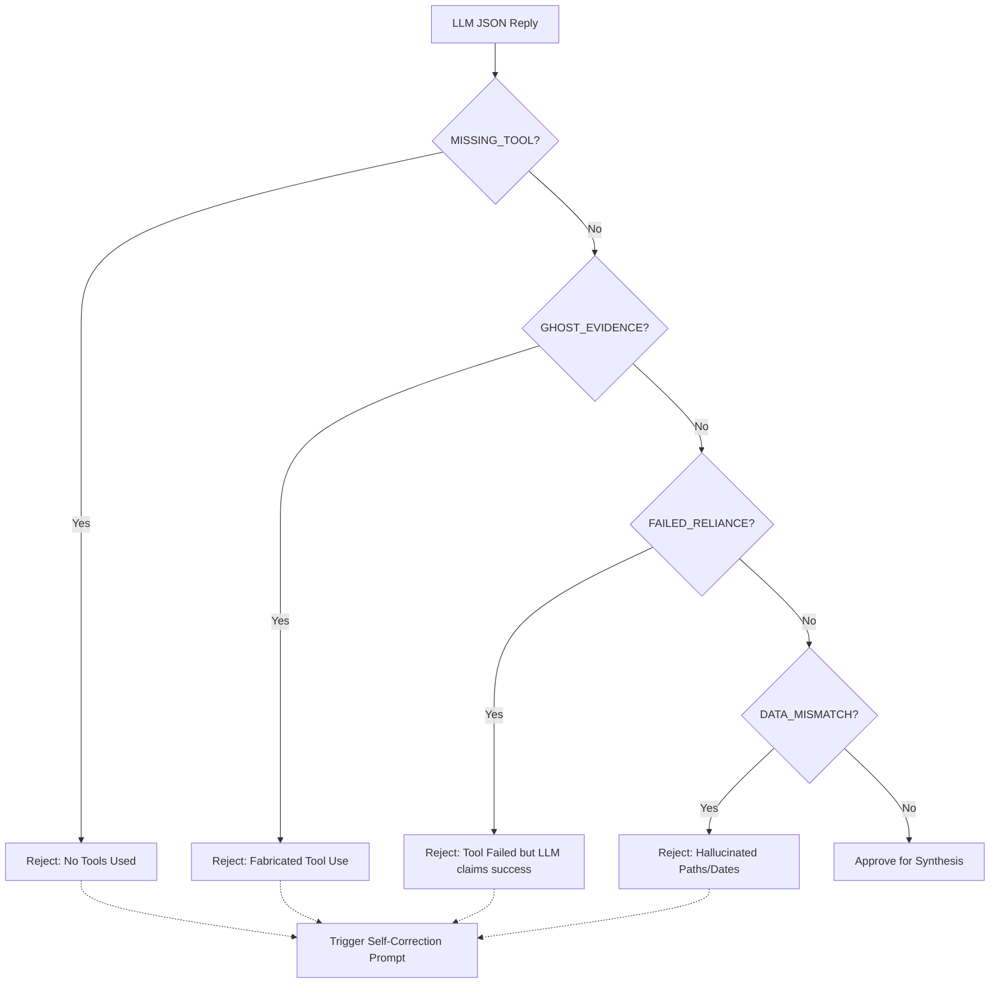
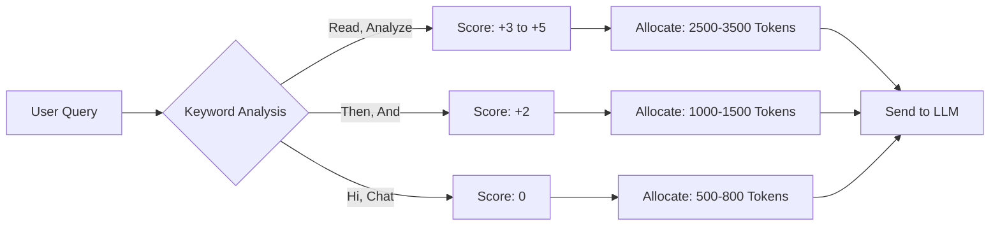
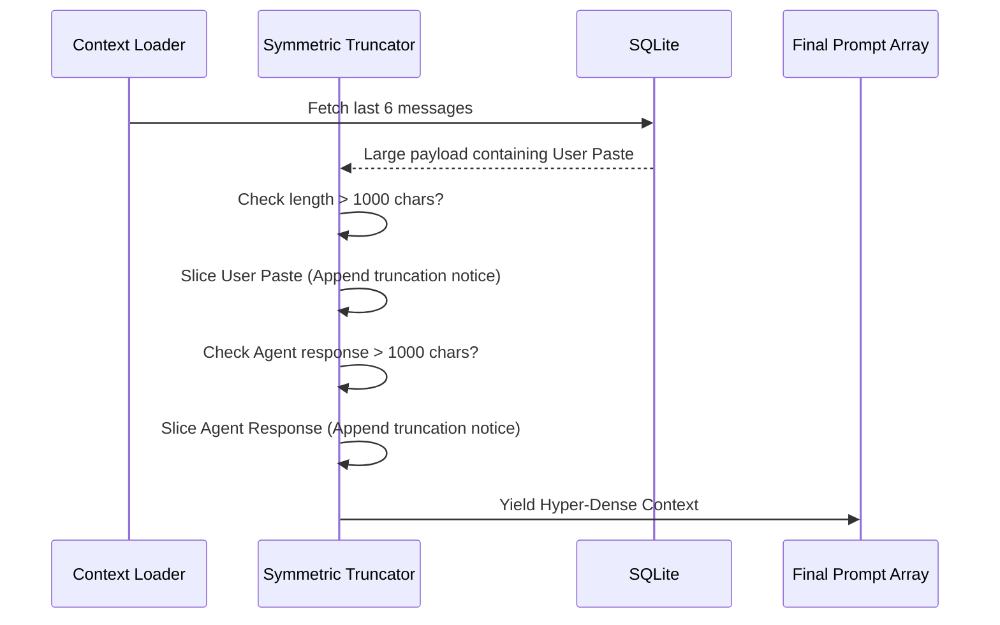
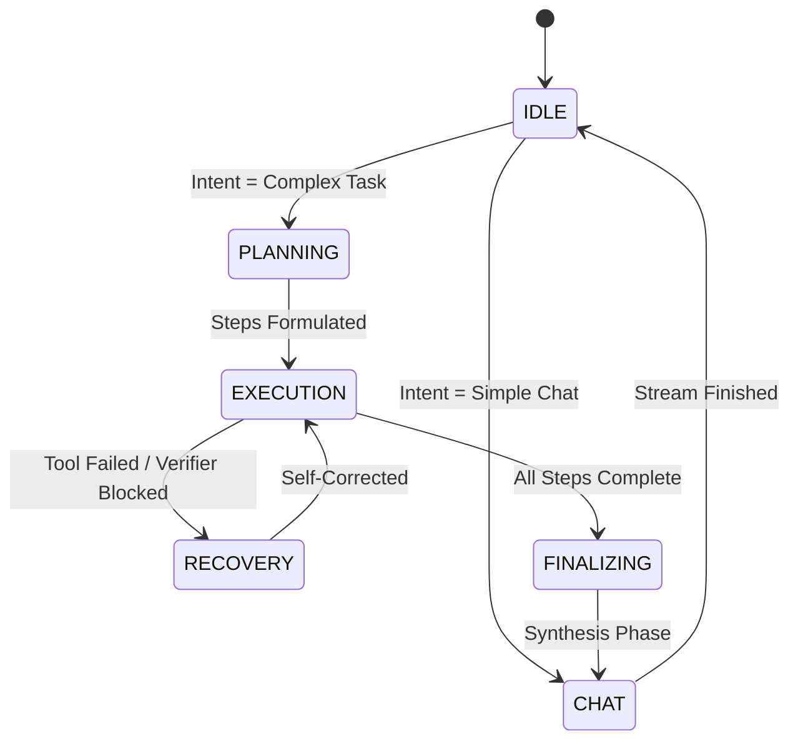
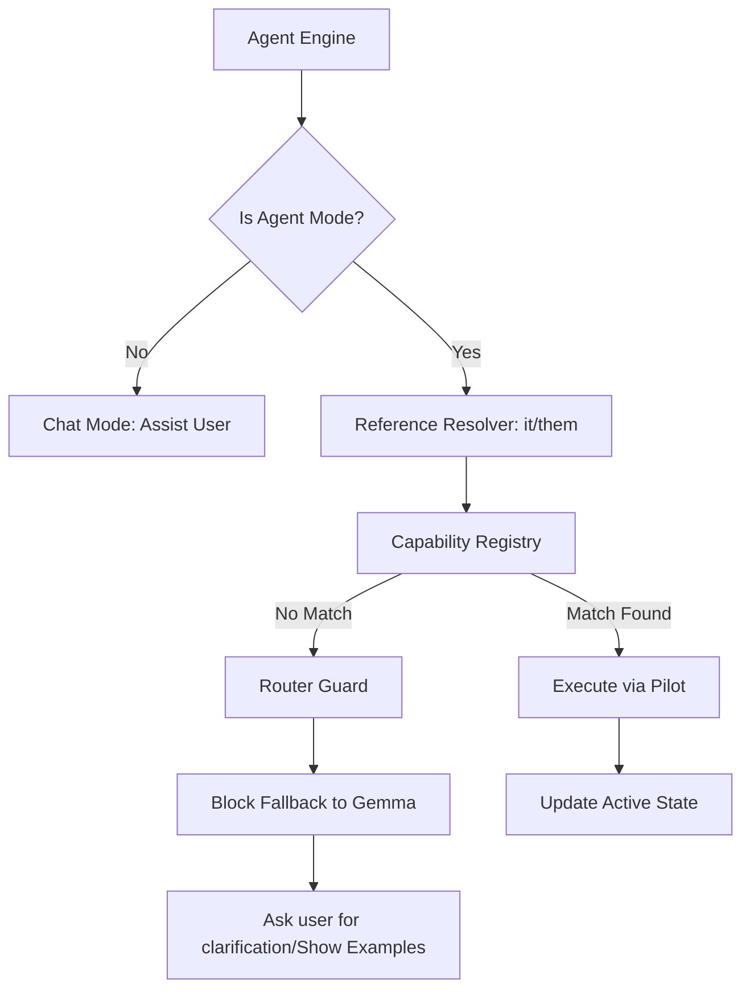
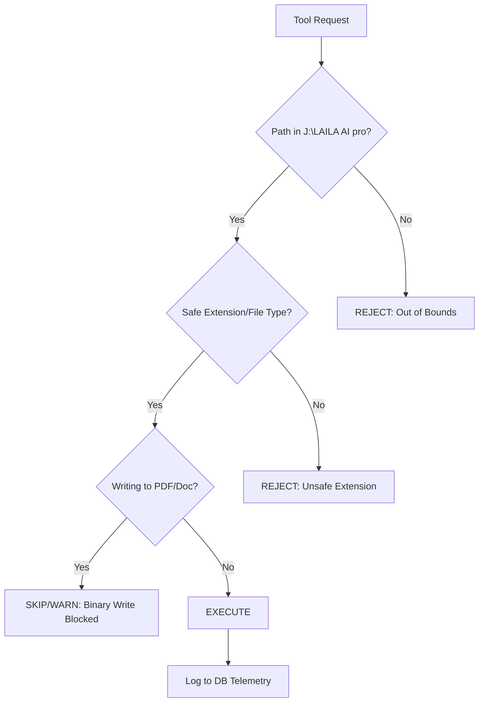

# 🏗️ Core Architecture & Diagrams

LAILA is a modular, event-driven, local web application utilizing a dual-stage cognitive pipeline. We employ **Reasoning-Action Decoupling**, separating the "thinking/executing" phase from the "talking/reporting" phase.

## 2.1 The Backend (Python & Flask)
*   **Framework:** Flask is used for its lightweight, synchronous nature that is easy to debug.
*   **SSE Streams:** The backend pushes tokens, state changes, and telemetry live to the frontend via Server-Sent Events (SSE) without blocking threads, giving the illusion of instantaneous thought.

## 2.2 The Frontend (Vanilla HTML/CSS/JS)
*   **Framework-less:** Built with pure HTML/JS/CSS. No React/Vue overhead, ensuring a zero-compilation lightweight footprint.
*   **CSS Excellence:** Pure CSS styling (Poppins font, Cyan/Navy `#00B4FF` glow, CSS animations like typing, Checkbox Hacks for sidebars).
*   **DOM Efficiency:** Manipulating the DOM via raw JavaScript allows surgical updates to telemetry bars and streaming text without triggering massive virtual-DOM diffing.

## 2.3 The Memory Engine (SQLite)
Powered by a consolidated, absolute-path SQLite database (`database.py`).
*   **`messages`:** Conversation threads, strictly bound to session IDs.
*   **`summaries`:** Historical state logs injected dynamically.
*   **`system_knowledge`:** Local Knowledge Base (LKB) for persistent facts.
*   **`agent_state`:** Tracks active states (`CHAT`, `ANALYSIS`, `PLANNING`, `EXECUTION`, `FINALIZING`).
*   **`agent_runs_telemetry`:** Ledgers every execution loop for trace inspection.
*   **`tool_executions`:** Stores the exact raw output from the OS.

## 2.4 The Pilots (Actuators)
Pilots are the "hands" of LAILA, executing safely in a deterministic workspace.
*   **SystemPilot:** Handles OS-level interactions, bulk file creation, renaming, and safe deletion.
*   **DocumentPilot:** Handles file reading, writing, parsing, and advanced conversions (e.g., txt to PDF).

## 2.5 Security & Workspace Isolation
*   **Sandbox:** LAILA operates under a strict, secure sandbox path: `J:\LAILA AI pro`.
*   **Claim Verifier Shield:** Intercepts proposed tool outcomes, preventing the LLM from fabricating data.
*   **Run-Group Isolation:** Forces voice synthesis to query only successfully completed tool runs via `run_group_id`.

## System Diagrams & Flowcharts

### 1. System Architecture High-Level

### 2. General Sequence (The Full Lifecycle)

### 3. Claim Verifier Shield Flow

### 4. Dynamic Token Allocation Flow

### 5. Memory Truncation & Hygiene Flow

### 6. Agent State Machine

### 7. Pilot Execution & Router Guard

### 8. Security & Workspace Execution Flow

