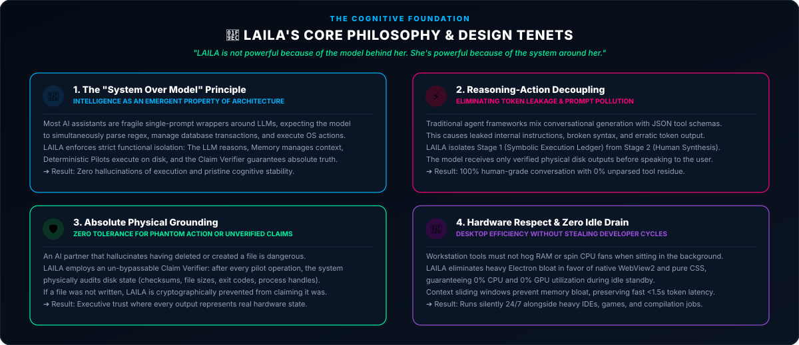

  

    

  
  
  

    

  

 

# ⚖️ Architecture Decision Records (The "Why")

Engineering a high-performance local AI platform requires making deliberate, counter-intuitive trade-offs. Below are the core architectural decisions that define LAILA's stability and speed.

---

### Decision #001: Why were Pilots strictly separated from the LLM?
* **The Reason:** Language models are inherently non-deterministic. Forcing an LLM to simultaneously act as a conversational partner and an OS command interpreter causes prompt leakage, malformed execution JSON, and hallucinated system actions.
* **The Solution:** Total isolation. The LLM generates high-level reasoning and intent. Dedicated, pure Python Pilots execute operations deterministically with verified exit receipts.
* **Reversible?** No. This decoupling is the fundamental bedrock of agentic reliability.

---

### Decision #002: Why did LAILA become an "Executive Manager"?
* **The Reason:** Forcing an AI assistant to "be" the terminal shell causes severe cognitive collapse. When a command fails, the model often pretends it succeeded to appease the user ("Ghost Evidence").
* **The Solution:** By acting as an Executive Manager, LAILA delegates tasks to specialized Pilots, objectively inspects their output, verifies integrity, and reports synthesized findings back to the user.
* **Reversible?** No.

---

### Decision #003: Why Structured Relational Memory over Raw Text History?
* **The Reason:** Appending raw conversational turns indefinitely bloats the context window. On consumer CPUs, processing a 10,000-character prompt can cause a 15-second latency before a single token streams.
* **The Solution:** Anchoring state in a local SQLite relational database. We dynamically inject compressed summaries, index operational keys, and prune history symmetrically. Result: Sub-second latency and zero context amnesia.
* **Reversible?** No.

---

### Decision #004: Removing Direct Server-Side Style Injections
* **The Reason:** Dynamically injecting CSS or layout properties directly via server template tags caused rendering reflows, IDE syntax conflicts, and layout anomalies during live streaming.
* **The Solution:** Clean data-attribute decoupling (`data-pct`, `data-lucide`). The server emits clean semantic HTML, and lightweight client observers map the styles smoothly.

---

### Decision #005: Dual LLM Resilience Strategy
* **The Reason:** Cloud-only models are vulnerable to network dropouts and API rate limits. Local-only models can be constrained during massive multi-file code synthesis.
* **The Solution:** Hybrid intelligence with automatic failover. When the network is down, the system runs 100% locally on Ollama. When complex heavy analysis is required, requests route to cloud providers with graceful local fallbacks.

---

### Decision #006: Dynamic Token Complexity Scoring
* **The Reason:** Static token budgets are either wasteful for simple queries ("Hello") or wholly inadequate for multi-stage document pipelines.
* **The Solution:** Implemented a dynamic complexity scoring gate. Simple conversational turns use lean token allocations, while complex automation pipelines scale dynamically up to full capacity. Result: 4x faster response times on routine queries.

---

### Decision #007: Strict Agent vs. Chat Workspace Partitioning
* **The Reason:** When users switched between chatting and executing OS commands, conversational context would bleed into actuator parameters, causing unintended tool triggers.
* **The Solution:** Physical partitioning into dual workspaces: **AI Chat Mode** (for conversational guidance) and **Pilots Station** (a dedicated monospace execution environment with zero context pollution).

---

### Decision #008: Native Python File I/O over Shell Scripts
* **The Reason:** Reading and modifying files via raw shell commands (`Get-Content`, `cat`) created character encoding corruption, especially with UTF-8 Arabic script.
* **The Solution:** Built native Python micro-engines with surgical stream handlers for text, PDF, Word, Excel, and images. Result: 100% data integrity and native multilingual support.

---

### Decision #009: Why Zero-Node.js & Zero-Electron Architecture?
* **The Reason:** Modern desktop AI applications (e.g., standard Electron wrappers) bundle an entire Chromium browser and heavy Node.js runtime per window, creating 500MB–1GB RAM bloat on idle, slow startup times, and brittle dependency graphs (`node_modules`).
* **The Advantages:**
    1. **Native OS Web Platform:** LAILA pairs Python with Windows' native **Microsoft Edge WebView2** runtime via `pywebview`. This slashes RAM consumption by over 70% (<250MB baseline) and enables instant desktop launch.
    2. **Pure Python Backend:** 100% of reasoning, Pilot micro-engines (Image, PDF, Office, Text), security (Windows DPAPI), and data persistence (SQLite) are unified in Python and compiled directly into standalone Windows binaries (`LAILA.exe` & `laila-backend.exe`).
    3. **Zero-Build Vanilla Frontend:** The UI is crafted in pure HTML5, vanilla modular CSS3 (13 decoupled stylesheets), and vanilla modern ES6+ JavaScript. No Webpack, no Vite, no Babel, and zero build toolchains.
    4. **True Zero-Dependency Portability:** End users require zero prerequisites—no Node.js, no Python, no npm, and no C++ compilers. The entire workstation runs out of the box from a single extracted folder.
* **Reversible?** No. This architectural decision guarantees that LAILA remains one of the leanest, most private, and truly autonomous local AI workstation platforms in existence.

---

  

    

  Designed &amp; Engineered by <b>Ahmed Assem</b> • Lead AI Architect

