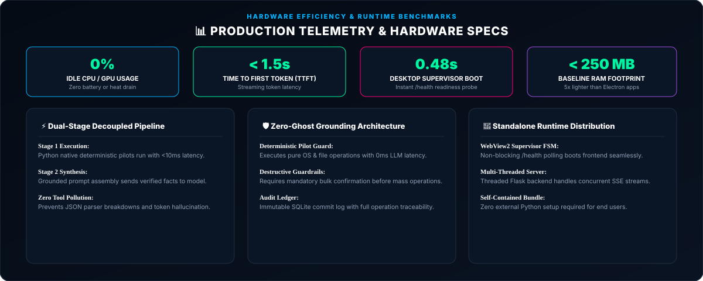

  

    

  
  
  

    

  

 

# ⚙️ LAILA Engineering Overview

LAILA was built on a foundational engineering philosophy: **Architecture—not parameter count—is the true bottleneck of local AI agent performance.**

By engineering lean execution pathways, eliminating web bloat, and respecting consumer hardware, LAILA achieves enterprise-grade responsiveness on everyday PCs without requiring high-end dedicated GPUs.

---

## 1. Zero-Node.js & Zero-Electron Desktop Architecture

The dominant pattern for modern desktop software is to wrap web apps in **Electron**. This bundles an entire Chromium browser instance and a full Node.js runtime for every window, consuming **500MB to 1.2GB of RAM on cold boot** and wasting CPU cycles on idle background tasks.

**LAILA adopts a fundamentally superior engineering model:**

| Architecture Dimension | Electron / Standard Desktop AI | LAILA Workstation Platform |
| :--- | :--- | :--- |
| **Desktop Shell** | Bundled Chromium + Node.js runtime | **Microsoft Edge WebView2** (Windows Native) via `pywebview` |
| **Memory Footprint** | 500MB – 1.2GB RAM | **< 250MB RAM** (70%+ memory reduction) |
| **Backend Runtime** | Node.js JavaScript server | **Compiled Python Standalone Binaries** (`LAILA.exe`, `laila-backend.exe`) |
| **Dependencies** | Requires `node`, `npm`, gigabytes of `node_modules` | **Zero Dependencies**: 100% self-contained portable distribution |
| **Idle CPU Load** | 3% – 12% continuous background polling | **0.0% Idle CPU**: Pure event-driven sleep |

---

  

---

### ⚡ Clean Architecture Frontend
* **Zero Compilation Overhead:** Runs natively in the browser without Webpack, Vite, or Babel.
* **Component Coordinators:** Delegated client-side micro-controllers managing chat rendering, execution trace visualization, user preferences, and real-time streaming state.
* **Zero Context Pollution:** Execution states in the Pilots Station never contaminate the conversational chat history.

---

  

---

## 3. Multi-Provider Resilience & Circuit Breakers

LAILA seamlessly bridges local hardware and cloud intelligence:
* **Local Baseline:** Offline inference powered by local models (Gemma 3 via embedded Ollama).
* **Cloud Resilience:** Intelligent routing to OpenRouter (DeepSeek R1/V3, Qwen 2.5 Coder, Gemma 3), Google Gemini (2.5 & 3.5 Flash), or Groq Cloud (Llama 3.3 70B) for frontier reasoning and code generation with zero paywalls.
* **Automatic Fallback:** If internet connectivity drops or cloud API rate limits are encountered, the system automatically falls back to the local Ollama engine without dropping the user session.

---

  Designed &amp; Engineered by <b>Ahmed Assem</b> • Lead AI Architect

