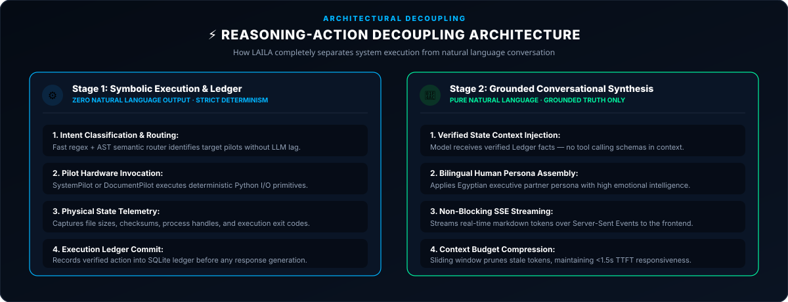

  

    

  
  
  

    

  

 

# 🧠 The Philosophy of LAILA AI

> *"LAILA is not powerful because of the model behind her. She is powerful because of the system around her."*
>
> *"The model thinks. The system remembers, acts, observes, and adapts. Together, they become intelligent."*
>
> *"Don't make the model work harder. Build a system that lets the model think better."*

---

## 1. Why LAILA Exists

Most modern AI assistants are thin wrappers around cloud language models. When you ask them to read a file, analyze data, or execute an operating system action, they either fail, hallucinate, or upload private user data to third-party servers.

**LAILA was engineered to solve this fundamentally:**
To bridge the chasm between conversational chatbots and true, fully autonomous, local-first OS workstation agents. The mission is to deliver an assistant that operates natively on local hardware, completely offline if required, without context amnesia, without execution friction, and with uncompromising user privacy.

---

## 2. Core Problems Solved

### 1. Hallucination of Action ("Ghost Evidence")
Traditional LLMs frequently claim they executed an operation, modified a document, or gathered data when they never actually touched the underlying system.
* **LAILA's Solution:** Strict decoupling of reasoning from deterministic actuators. LAILA cannot claim an action succeeded unless an underlying verified Pilot returns an authentic execution receipt.

### 2. Context Bloat & Memory Degradation
Chatbots that append continuous conversation history quickly bog down local hardware. Processing a bloated 10,000-token prompt on a consumer CPU can cause a 15-second latency before generating a single word.
* **LAILA's Solution:** Structured, relational memory via SQLite. Context is pruned, indexed, and injected dynamically with exact relevance tokens.

### 3. Execution Friction
Blurring the boundary between "conversational human dialogue" and "JSON command emission" inevitably leads to malformed syntax, broken schemas, and leaked prompts.
* **LAILA's Solution:** Dual-workspace architecture. Pure conversational dialogue is physically decoupled from deterministic Pilot command execution.

### 4. Hardware Drain
Typical desktop AI tools consume 500MB to 1.5GB of RAM and waste 10–25% CPU cycles even when idling.
* **LAILA's Solution:** Zero idle CPU/GPU consumption. The background engine sleeps until triggered, with memory consumption held strictly under 250MB.

---

  

---

## 3. The Executive Manager Pattern

Instead of forcing a single language model to simultaneously act as the terminal emulator, file system parser, database administrator, and conversational companion:

**LAILA acts as an Executive Manager.**
1. She listens and interprets the user's intent.
2. She formulates a strategic plan.
3. She delegates deterministic operations to specialized Pilots (`SystemPilot`, `DocumentPilot`).
4. She reviews verified execution artifacts.
5. She reports back to the user with synthesized, human-level clarity.

---

  

---

## 4. Fundamental Tenets

* **Local-First Sovereignty:** The platform runs 100% locally with zero required internet connectivity, powered by offline LLMs (Gemma 3 4B via Ollama).
* **Deterministic Grounding:** Zero tolerance for fake system actions. True autonomy requires verifiable truth.
* **System Resource Respect:** Zero idle load. Clean thread shutdowns. Efficient memory reclamation.
* **Radical Observability:** Complete transparency into every cognitive loop, execution path, and resource metric via the live telemetry dashboard.

---

  

    

  Designed &amp; Engineered by <b>Ahmed Assem</b> • Lead AI Architect

