

  

    

  
  
  
  
  
  

    

  

    

  

    

  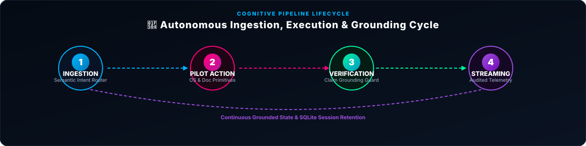

    

  

    

  

    

  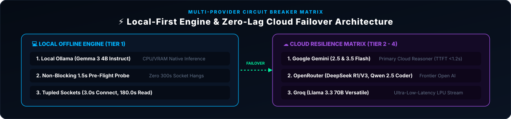

    

  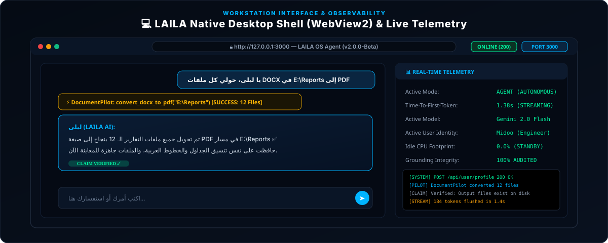

    

  <!-- Production Screenshots Gallery -->
  

  <!-- 0. Native Workstation Welcome Hub -->
  
<b>🌐 00. Native Workstation Welcome Hub & Quick Navigation Guide</b>

  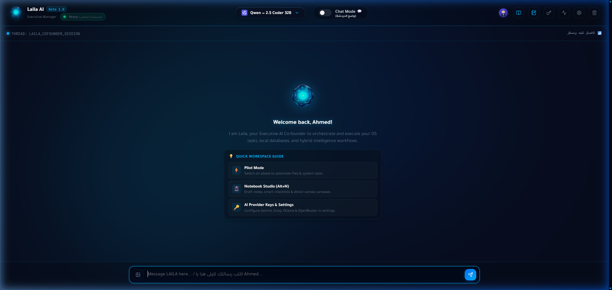

    

  <!-- 1. Main Conversational Workspace -->
  
<b>💬 01. Conversational Intelligence & Real-Time Code Synthesis</b>

  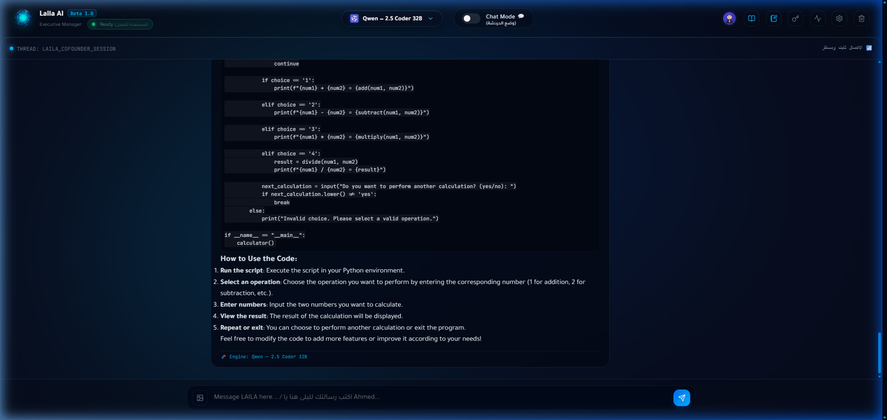

    

  <!-- 2. Frontier Model Selection Matrix -->
  
<b>🧠 02. Frontier Multi-Model Matrix (DeepSeek R1/V3, Qwen 2.5 Coder, Gemma 3, Groq)</b>

  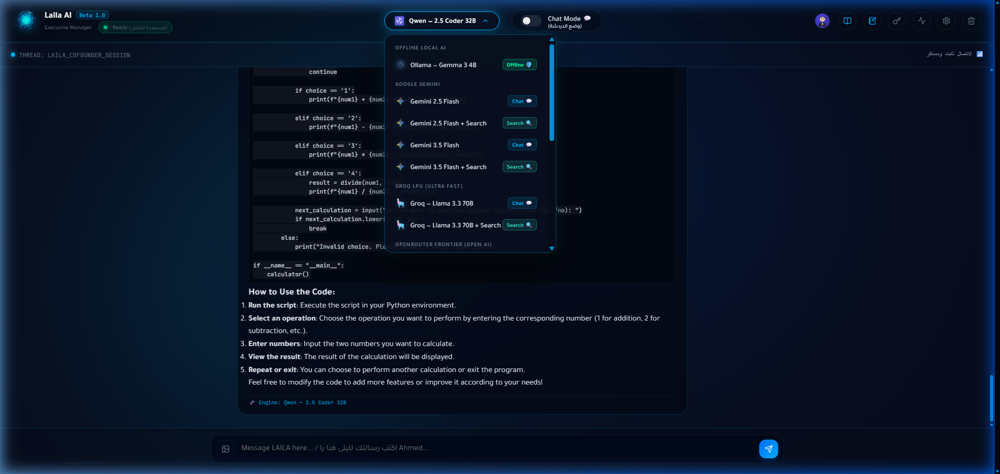

    

  <!-- 3 & 4. Dual Workspace: Pilots Station & Executive Notebook Hub -->
  <table width="100%">
    <tr>
      <td width="50%" align="center" valign="top">
        
<b>⚡ 03. Pilots Station (Deterministic OS Actuators)</b>

        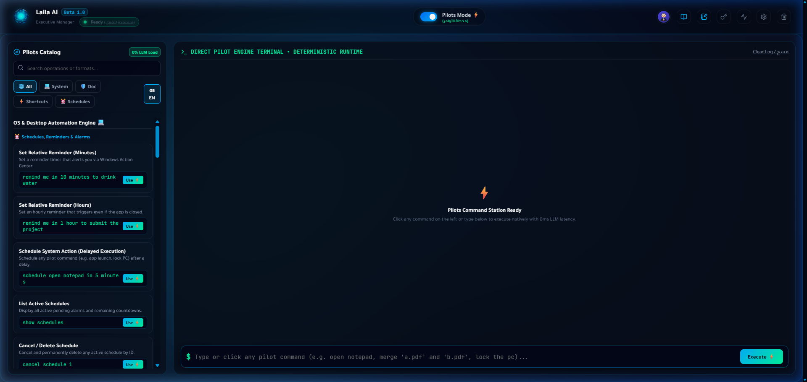
      </td>
      <td width="50%" align="center" valign="top">
        
<b>📓 04. Executive Notebook Hub (Keep Notes Library)</b>

        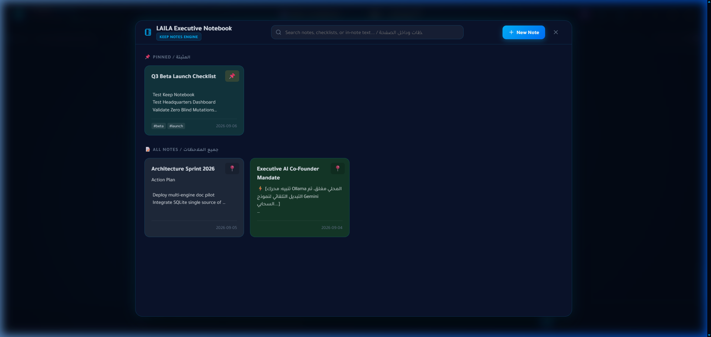
      </td>
    </tr>
  </table>

    

  <!-- 5 & 6. Notebook Studio: Rich Editor & Multi-Format Exports -->
  <table width="100%">
    <tr>
      <td width="50%" align="center" valign="top">
        
<b>📝 05. Notebook Studio (Direct Canvas AI Drafting, Smart Checklists & Markdown)</b>

        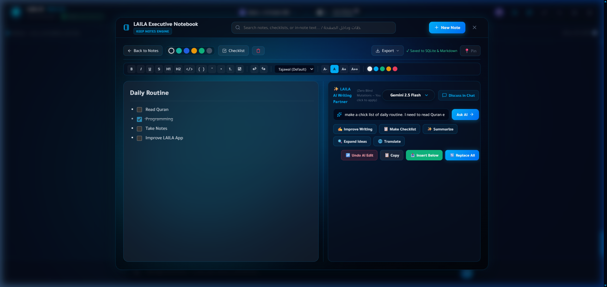
      </td>
      <td width="50%" align="center" valign="top">
        
<b>📑 06. Document Engine Exports (PDF, Word DOCX, Markdown, CSV)</b>

        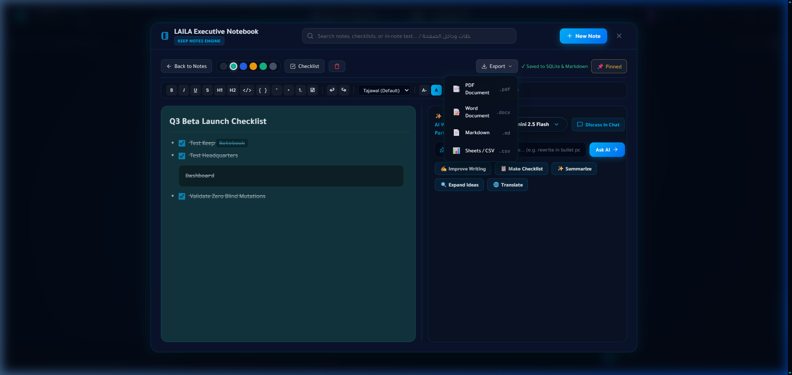
      </td>
    </tr>
  </table>

    

  <!-- 7 & 8. Security & Telemetry -->
  <table width="100%">
    <tr>
      <td width="50%" align="center" valign="top">
        
<b>🔐 07. AI Providers Matrix (Windows DPAPI Hardware Encryption)</b>

        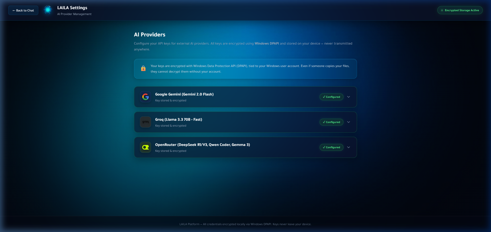
      </td>
      <td width="50%" align="center" valign="top">
        
<b>📊 08. Executive Telemetry Dashboard & Memory Ledger</b>

        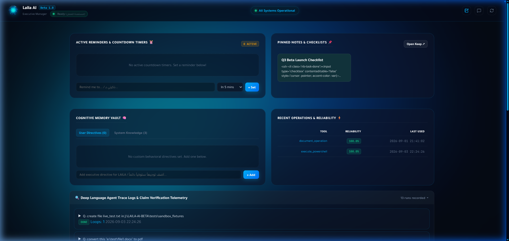
      </td>
    </tr>
  </table>

    

  <!-- 9 & 10. Capabilities & Customization -->
  <table width="100%">
    <tr>
      <td width="50%" align="center" valign="top">
        
<b>📖 09. Pilots Command Hub & Action Catalog</b>

        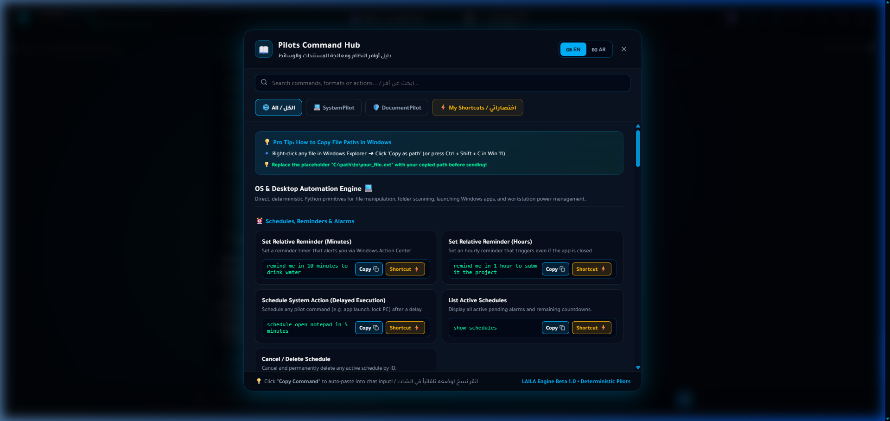
      </td>
      <td width="50%" align="center" valign="top">
        
<b>👤 10. User Profile & Persona Customization Modal</b>

        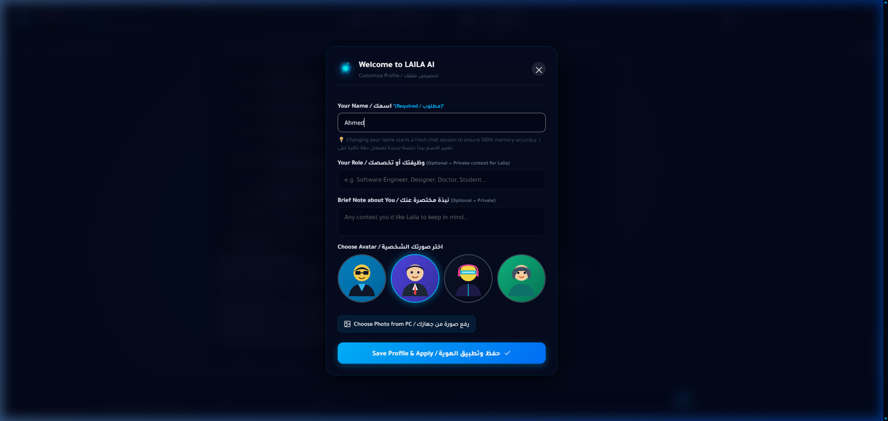
      </td>
    </tr>
  </table>

    

  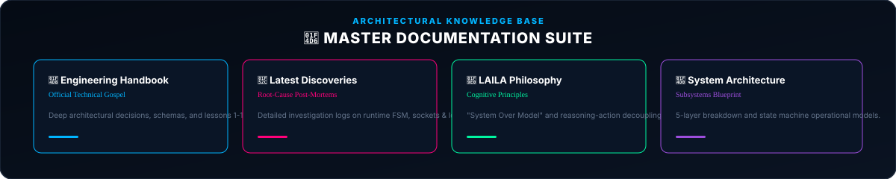

    

  ### 📚 Comprehensive Documentation Suite
  
  [🧠 **LAILA's Philosophy**](Documents/Lailas-Philosophy.md) &nbsp;•&nbsp; 
  [🏗️ **Architecture Overview**](Documents/Architecture-Overview.md) &nbsp;•&nbsp; 
  [⚙️ **Engineering & Benchmarks**](Documents/Engineering-Overview.md) &nbsp;•&nbsp; 
  [📖 **Engineering Handbook**](Documents/Engineering-Handbook.md) &nbsp;•&nbsp; 
  [🔬 **Deep Technical Research**](Documents/Deep_Research.md) &nbsp;•&nbsp; 
  [⚡ **Runtime Architecture**](Documents/LAILA_Runtime_Foundational_Architecture.md) &nbsp;•&nbsp; 
  [⚖️ **Design Decisions (ADRs)**](Documents/Design-Decisions.md) &nbsp;•&nbsp; 
  [💡 **Lessons Learned**](Documents/Lessons-Learned.md)

    

  Designed &amp; Engineered by <b>Ahmed Assem</b> • Lead AI Architect

