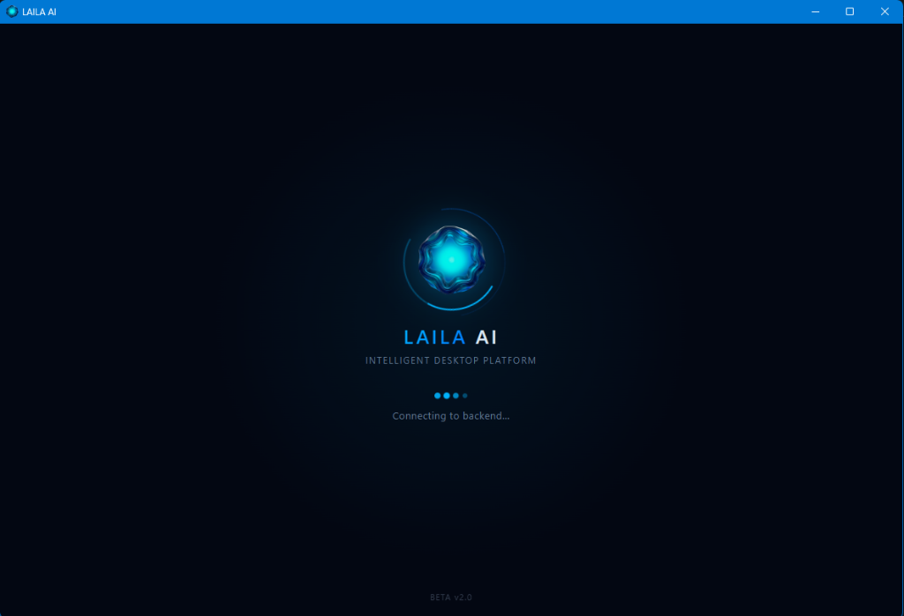

  

    

  
  
  
  
  

    

  

    

  

    

  

    

  

    

  

    

  

    

  

    

  <!-- Production Screenshots Gallery -->
  

    

  

    

  

    

  <table width="100%">
    <tr>
      <td width="50%" align="center">
        
      </td>
      <td width="50%" align="center">
        
      </td>
    </tr>
  </table>

    

  

    

  ### 📚 Core Documentation Suite
  
  [🧠 **LAILA's Philosophy**](Documents/Lailas-Philosophy.md) &nbsp;•&nbsp; 
  [🏗️ **Architecture Overview**](Documents/Architecture-Overview.md) &nbsp;•&nbsp; 
  [⚙️ **Engineering & Benchmarks**](Documents/Engineering-Overview.md) &nbsp;•&nbsp; 
  [⚖️ **Design Decisions (ADRs)**](Documents/Design-Decisions.md)

    

  Designed &amp; Engineered by <b>Ahmed Assem</b> • Lead AI Architect

